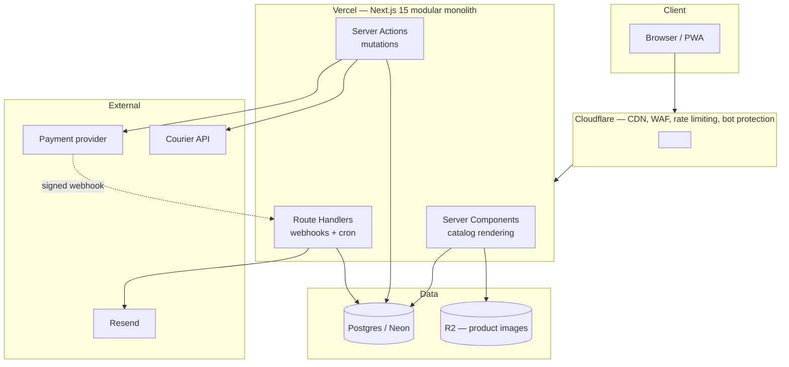
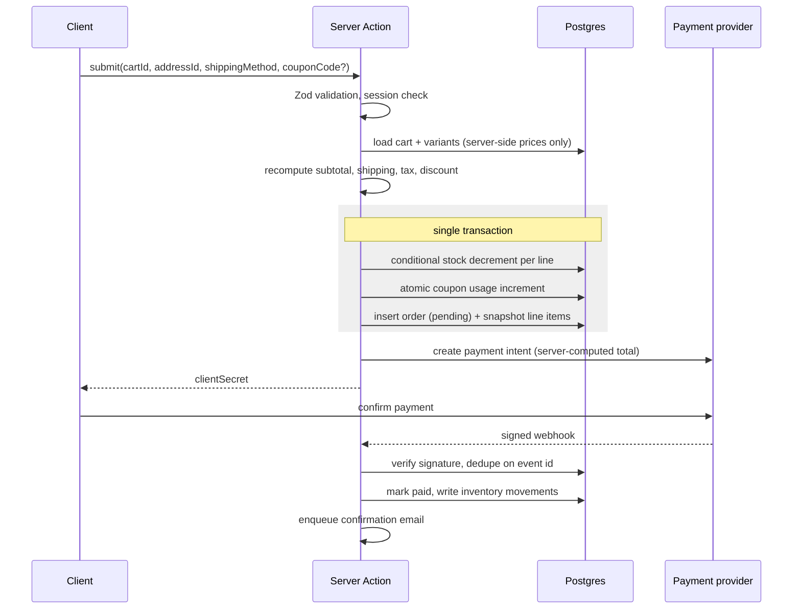

# 1. Architecture

## Design position

A single-vendor store with a few thousand SKUs is not a distributed systems problem.
Every architectural choice here trades scalability ceiling for **fewer moving parts**,
because at this size the realistic failure modes are bugs and operational mistakes, not
load.

Three things were deliberately rejected:

| Rejected | Why |
|---|---|
| Microservices | Network calls between services you deploy together are pure cost — latency, partial failure, distributed transactions, N pipelines. A modular monolith gives the same boundaries with none of it, and can be split later if load ever justifies it. |
| Message broker / event bus | Nothing here needs async decoupling. Order confirmation email is a transactional write plus a send. A Postgres `outbox` table drained by a cron route covers every genuine background need. |
| Edge database (D1/SQLite) | The catalog needs real relational queries, JSONB, and a path to `pgvector`. Edge write latency is also the wrong optimisation: reads dominate and the CDN already handles them. |

## System overview



## Module map

Each module owns its tables, its business rules, and a public API in `index.ts`.
Cross-module access goes through that file and nothing else.

```
src/
  app/                      routes only — thin, delegate immediately
    (shop)/                 storefront
    (account)/              signed-in customer area
    admin/                  admin dashboard
    api/                    webhooks, cron
  modules/
    accounts/               users, addresses, auth glue
    catalog/                products, categories, variants, images
    cart/                   cart state, line items, totals
    checkout/               orchestration only — owns no tables
    orders/                 order lifecycle
    payments/               provider interface + implementations
    shipping/               rate calculation, tracking
    inventory/              stock ledger, reservations
    promotions/             coupons, discounts
    reviews/
    notifications/          transactional email
    admin/                  admin-only operations
  lib/                      db client, auth, env, money, errors, utils
  components/ui/            shadcn primitives
```

Standard module layout:

```
modules/catalog/
  index.ts          public API — the only legal import path
  schema.ts         Drizzle tables + Zod validators
  repository.ts     data access, the only place Drizzle is called
  service.ts        business logic
  actions.ts        Server Actions
  components/       module-owned UI
```

### Dependency rule

```
app/  →  modules/  →  lib/
```

Imports flow one direction. `lib/` imports nothing from `modules/`. Two modules that
need each other's data usually mean a missing third module, or logic sitting in the
wrong place.

`checkout/` is the deliberate exception: it is an orchestrator that composes `cart`,
`inventory`, `promotions`, `shipping`, `payments`, and `orders`. It owns no tables of
its own. Keeping this coordination in one named place is what stops checkout logic
leaking into all six.

## Key flows

### Checkout

The critical path. Everything inside the transaction either commits together or not
at all.



Two failure modes this shape prevents:

- **Oversell** — stock moves in the same transaction as order creation, using a
  conditional update. Two simultaneous buyers of the last unit: one commits, one gets a
  clean out-of-stock error.
- **Price tampering** — the client never sends an amount. The total charged is computed
  from database rows in the same request that creates the payment intent.

If payment never completes, a cron route releases stock from orders left `pending`
past a 30-minute window.

### Catalog read

Product and category pages are statically rendered and served from CDN. A write in
admin calls `revalidateTag('product:<id>')`, so pages are fresh without any page being
rendered per request. This is where the "fast" requirement is actually met — see
[performance](05-performance.md).

## Background work

No queue. Two mechanisms:

1. **Outbox table** — side effects that must not be lost (order confirmation email,
   courier booking) are written inside the business transaction and drained by a cron
   route. Guarantees at-least-once delivery with no broker.
2. **Vercel Cron** — scheduled jobs: releasing expired pending orders, syncing
   tracking status, nightly stock reconciliation.

## Environments

| Environment | Branch | Database |
|---|---|---|
| Production | `main` | Neon primary |
| Preview | any PR | Neon branch, seeded |
| Local | — | Docker Postgres or Neon branch |

Preview deploys always use test-mode payment keys. Production secrets exist only in
Vercel's environment store.
