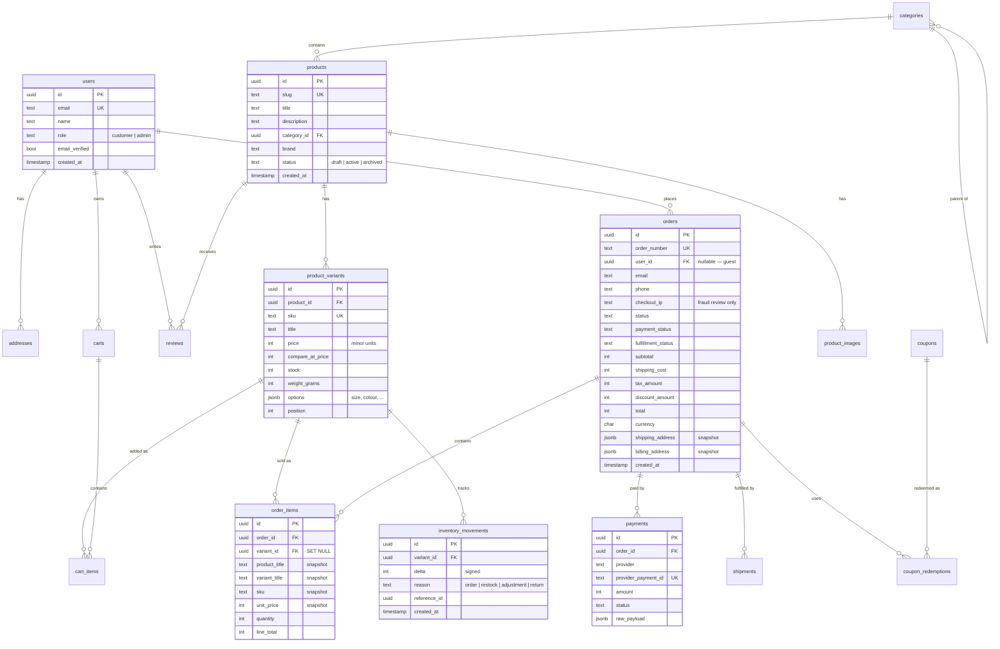

# 2. Data model

Postgres via Drizzle. Table and column names are `snake_case`; every table has `id`
(UUID v7, time-sortable), `created_at`, and — where mutable — `updated_at`.

## Decisions that are expensive to change later

These are the choices worth getting right before any code exists.

**1. Money is `integer`, in minor units.**
`199900` means ৳1,999.00 — amounts are stored in poisha, the minor unit of BDT. Never
`float`, never `numeric` for arithmetic in application code. Floating point money
produces rounding errors that surface as one-poisha discrepancies in reconciliation,
and they are miserable to trace. A `currency` char(3) is stored alongside every amount;
the store operates in **BDT** only.

Conversion to gateway units happens at the provider boundary and nowhere else —
SSLCommerz expects decimal BDT, so `199900 → "1999.00"` is the adapter's job. Storing
decimals internally to save that one conversion is how rounding bugs get in.

**2. Every product has at least one variant.**
Even a product with no options gets one default variant. The alternative — price and
stock on `products`, with variants bolted on later — is the single most common schema
refactor in e-commerce, and it touches cart, orders, and inventory simultaneously.
Price, SKU, stock, and weight live on `product_variants`, always.

**3. Order line items are denormalised snapshots.**
`order_items` copies title, variant title, SKU, and unit price at purchase time. The
FK to `product_variants` is `ON DELETE SET NULL` and exists only for analytics. An
order from last year must render correctly after the product is renamed, repriced, or
deleted. Joining live product data into order history is a correctness bug, not an
optimisation.

**4. Inventory is an append-only ledger.**
`inventory_movements` records every delta with a reason. `product_variants.stock` is a
cached projection of that ledger, maintained transactionally. This makes "why is stock
wrong?" answerable, which it never is when stock is only a mutable integer.

**5. Addresses are copied onto orders as JSONB.**
`orders.shipping_address` is a frozen snapshot, not a FK. Customers edit and delete
saved addresses; shipped orders must not change.

**6. Guest checkout is first-class.**
`orders.user_id` is nullable, `orders.email` is not. Forcing account creation before
purchase is a measurable conversion loss, and retrofitting guest support means
reworking every order query.

## ERD



## Table reference

### Identity — `accounts`

| Table | Notes |
|---|---|
| `users` | `role` is `customer` or `admin`. Two roles is enough; add more only when a real third job exists. |
| `sessions`, `accounts`, `verifications` | Managed by Better Auth. Do not hand-modify. |
| `addresses` | Belongs to a user. Bangladesh delivery fields include canonical district plus required Thana/Upazila and optional Union/Area. `is_default` per user. Soft-delete via `archived_at` so historical references stay intact. |

### Catalog — `catalog`

| Table | Notes |
|---|---|
| `categories` | Self-referencing `parent_id`, max two levels enforced in the service layer. Deeper trees create navigation and query problems worth avoiding. |
| `products` | Draft/active/archived. Archived products stay queryable for order history but are excluded from the storefront. |
| `product_images` | Ordered by `position`. R2 key plus alt text; the CDN URL is derived, not stored. |
| `product_variants` | Owns price, SKU, stock, weight. `options` JSONB holds `{"size": "M", "colour": "Red"}`. Unique on `sku`. |

Product search in Phase 1–5 is Postgres full-text (`tsvector` GIN index on title,
description, brand). This is genuinely fast to several thousand rows and adds no
dependency. A `products.embedding vector(1536)` column is the reserved seam for
Phase 6 semantic search — leave the space, don't build it yet.

### Commerce

| Table | Notes |
|---|---|
| `carts` | `user_id` **or** `session_token` — guests get a cart via signed cookie. Merged into the user cart on login. Abandoned carts pruned after 30 days. |
| `cart_items` | Stores `unit_price` at add time for display only. Checkout always recomputes from `product_variants`. |
| `orders` | `order_number` is human-readable and sequential-ish for support conversations; `id` stays a UUID. Three independent status fields — an order can be paid but unfulfilled, or fulfilled but refunded. Collapsing them into one enum is a mistake. |
| `order_items` | Snapshots. See decision 3. |
| `payments` | One row per attempt, not per order — failed and retried payments must both be visible. `raw_payload` retains the provider response for disputes. Manual transfers add `submitted_reference`, `proof_r2_key`, `verified_by`, `verified_at` — null for gateway payments. `provider` is `sslcommerz`, `bank_transfer`, or `cod`. COD remains `awaiting_collection`/`cod_pending` until delivery, so it is never reported as collected revenue early. |
| `shipments` | Carrier, tracking number, status. An order may ship in multiple parcels. |
| `inventory_movements` | Append-only. Never update or delete a row here. |

### Growth

| Table | Notes |
|---|---|
| `coupons` | `percent`, `fixed`, or `free_shipping`. `usage_count` incremented atomically inside the checkout transaction — a non-atomic increment is how coupons get over-redeemed. |
| `coupon_redemptions` | Enforces per-user limits and gives an audit trail. |
| `reviews` | `status` gates publication; nothing appears unmoderated. `order_id` present means verified purchase. |

### Operational

| Table | Notes |
|---|---|
| `webhook_events` | Unique on `(provider, event_id)`. Validate with the provider first, then insert the event and settle the exact payment attempt/order in one transaction. A conflict is a handled replay; a transient validation failure never consumes the id. |
| `outbox` | Side effects written inside business transactions, drained by cron. At-least-once delivery without a broker. |
| `audit_logs` | Every admin mutation: actor, action, entity, JSONB diff, IP. Append-only. |
| `fraud_blocks` | Active and revoked phone/email/IP checkout blocks. Every add/remove action is admin-only and audit logged. |

## Indexing

Beyond primary and foreign keys:

```sql
CREATE UNIQUE INDEX ON products (slug);
CREATE INDEX ON products (status, category_id);
CREATE UNIQUE INDEX ON product_variants (sku);
CREATE INDEX ON product_variants (product_id, position);
CREATE INDEX ON orders (user_id, created_at DESC);
CREATE INDEX ON orders (email, created_at DESC);      -- guest order lookup
CREATE UNIQUE INDEX ON orders (order_number);
CREATE INDEX ON order_items (order_id);
CREATE INDEX ON inventory_movements (variant_id, created_at DESC);
CREATE UNIQUE INDEX ON webhook_events (provider, event_id);
CREATE UNIQUE INDEX ON meta_event_deliveries (event_id);
CREATE INDEX ON meta_event_deliveries (status, attempts, created_at);
CREATE INDEX ON reviews (product_id, status);
CREATE INDEX ON products USING GIN (search_vector);
```

`orders (email, created_at DESC)` matters more than it looks: guest order lookup is a
support-desk operation that runs constantly and has no user ID to filter on.

`meta_order_attributions` is consent-scoped and separate from the accounting order.
It stores only the `_fbp`/`_fbc` identifiers, checkout user agent and source URL needed
to match a later paid order. Account deletion removes it before the retained order is
anonymised. `meta_event_deliveries` is the Postgres outbox for `Purchase`; its unique
event id makes retries safe and matches the browser Pixel id for Meta deduplication.

## Migrations

Generated with `drizzle-kit generate`, reviewed by hand, applied by
`scripts/migrate.mjs`. Never hand-edit a generated file after it has been applied
anywhere. Never run `drizzle-kit push` against production. Destructive migrations get
split: deploy the additive change, backfill, then remove the old column in a later
release.

**On deploy:** Vercel runs the `vercel-build` script, which migrates *before* Next
compiles. A failed migration fails the build — far better than shipping code whose
tables do not exist and 500ing every page. Drizzle records applied migrations in
`__drizzle_migrations`, so re-running on every build is a no-op.

The same script runs locally via `pnpm db:migrate`, so the thing tested is the thing
that deploys.

**Preview deployments use an isolated Neon branch.** The Neon/Vercel integration
creates a branch per Preview deployment and injects its branch-specific `DATABASE_URL`.
The Preview branch is migrated before compilation, so checkout is tested against the
exact schema in its code without writing test orders or unreviewed migrations into
Production. The integration must remain connected with Preview branching enabled; do
not replace its managed Preview `DATABASE_URL` with the Production connection string.
